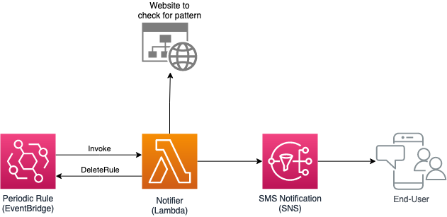

# checkthe.page

Simple serverless service for periodically checking a web page a pattern and send an SMS notification to a mobile number if found.


## Features

- Periodic invocation (via EventBridge)
- Flexible HTTP(S) request configuration
	- Query strings
	- Headers
	- Body
- Regex driven pattern matching
- Session ID support


## Architecture



*Made using [draw.io](https://app.diagrams.net/), source file: [notifier.drawio](docs/notifier.drawio)*


## Prequisites

* [Git](https://git-scm.com/) (of course)
* [AWS Account](https://portal.aws.amazon.com/billing/signup#/)
* [AWS CLI](https://docs.aws.amazon.com/cli/latest/userguide/cli-configure-quickstart.html#cli-configure-quickstart-config)
* [Python 3](https://www.python.org/downloads/)
* [SAM CLI](https://docs.aws.amazon.com/serverless-application-model/latest/developerguide/serverless-sam-cli-install.html)


## Setup: Deployment

```bash
# Clone the repo

git clone https://github.com/aaronbrighton/checkthe.page.git
cd checkthe.page

# Build & deploy the Notifier Lambda

sam build
sam deploy --stack-name checkthepage --guided
```


## Usage: Monitor a page

Create a CloudWatch rule that periodically invokes the Notifier Lambda and uses InputTransformer to pass an event with the page to check, regex pattern to look for, and the generated the CloudWatch rule ARN.

You'll want to customize the below InputTemplate and options passed to the add_watcher.py script based on your situation.  You can rerun the below as many as times as you want to monitor multiple pages simultaneously.

**CloudWatch rule lifecycle**: The CloudWatch rule will exist and continue executing the Notifier Lambda until a match is found, at which time it will delete the CloudWatch rule and cease any further page checks.

For additional usage options, please refer to the examples under the "InputTemplate" section.

```bash
# Generate a CloudWatch rule InputTemplate
echo '
{
    "trigger_request": {
        "method": "GET",
        "url": "https://dedicated.com/includes/dedicated-servers-list.php",
        "headers": {
            "referer": "https://dedicated.com/dedicated-servers",
            "User-Agent": "Mozilla/5.0 (Windows NT 10.0; Win64; x64; rv:74.0) Gecko/20100101 Firefox/74.0",
            "X-Requested-With": "XMLHttpRequest",
            "TE": "Trailers"
        },
        "data": {
            "ajax": "ajax"
        },
        "trigger_pattern_regex": "pid=1&configoption\\\[102\\\]=453((?!Out).)*?(?=<\\\/p>)"
    },
    "notify_phone": "+1-555-555-5555",
    "notify_message": "E3-1230v2 in Los Angeles is now available via dedicated.com!",
    "rule_arn": "<resources>"
}
' > cloudwatch_rule_event_template.json

# Retrieve the Notifier Lambda ARN from the previously SAM deployment
LAMBDA_ARN=`aws cloudformation describe-stacks --stack-name checkthepage --query "Stacks[0].Outputs[?OutputKey=='NotifierFunction'].OutputValue" --output text`
INVOCATION_ROLE_ARN=`aws cloudformation describe-stacks --stack-name checkthepage --query "Stacks[0].Outputs[?OutputKey=='NotifierFunctionInvocationRole'].OutputValue" --output text`


# Create the CloudWatch Rule
python3 add_watcher.py --name E3-1230v2_LA --period "15 minutes" --role $INVOCATION_ROLE_ARN --lambda-arn $LAMBDA_ARN cloudwatch_rule_event_template.json
```

## InputTemplate

### Examples

#### dedicated.com

The following InputTemplate monitors [https://dedicated.com/dedicated-servers](https://dedicated.com/dedicated-servers) for when certain configurations become available.

**"trigger_pattern_regex" escaping** - The below example is the same as the one used in the "Use: Monitor a page" section above.  However, you'll notice above we have "\\\\\\" and here we have "\\\\".  The **original regex, actually only has a single escaping backslash** "\\".  However, below the regex is a value **in a JSON object, so the single backslashes need to be escaped**.  Additionally, in the above example, we are using the JSON string **in a Bash command and need to additionally escape the backslashes a third time**.

**"rule_arn" placeholder** - Officially, CloudWatch target InputTransformer.InputTemplates require placeholders (`<resources>`) to **NOT** be wrapped in quotes, however, we want this file to be valid JSON, and therefore we unwrap it as part of the **add_watcher.py** script.
```json
{
    "trigger_request": {
        "method": "GET",
        "url": "https://dedicated.com/includes/dedicated-servers-list.php",
        "headers": {
            "referer": "https://dedicated.com/dedicated-servers",
            "User-Agent": "Mozilla/5.0 (Windows NT 10.0; Win64; x64; rv:74.0) Gecko/20100101 Firefox/74.0",
            "X-Requested-With": "XMLHttpRequest",
            "TE": "Trailers"
        },
        "data": {
            "ajax": "ajax"
        },
        "trigger_pattern_regex": "pid=1&configoption\\[102\\]=453((?!Out).)*?(?=<\\/p>)"
    },
    "notify_phone": "+1-555-555-5555",
    "notify_message": "E3-1230v2 in Los Angeles is now available via dedicated.com!",
    "rule_arn": "<resources>"
}
```

#### kimsufi.com

The following InputTemplate monitors [https://www.kimsufi.com/en/servers.xml](https://www.kimsufi.com/en/servers.xml) for when certain configurations become available.

**"session_request"** - For sites that require you to send a preliminary request to get a session ID first, you can use the `"session_request"` object.  Use the `"session_identifier_regex"` property to extract the session ID from the request body response, inject it anywhere in the `"trigger_request"` by referring to it using `{SESSIONID}` (as you can see in the `trigger_request.params.params` below).

```json
{
    "session_request": {
        "method": "GET",
        "url": "https://ws.ovh.com/sessionHandler/r4/ws.dispatcher/getAnonymousSession",
        "params": {
            "callback": "angular.callbacks._1",
            "params": "{\"language\":\"ie\"}"
        },
        "headers": {
            "referer": "https://www.kimsufi.com/en/order/kimsufi.xml?reference=1804sk18"
        },
        "session_identifier_regex": "id\":\"(.*?)\""
    },
    "trigger_request": {
        "method": "GET",
        "url": "https://ws.ovh.com/order/dedicated/servers/ws.dispatcher/getPossibleOptionsAndAvailability",
        "params": {
            "callback": "angular.callbacks._3",
            "params": "{\"sessionId\":\"{SESSIONID}\",\"billingCountry\":\"KSEU\",\"dedicatedServer\":\"1804sk18\",\"installFeeMode\":\"directly\",\"duration\":\"1m\"}"
        },
        "headers": {
            "referer": "https://www.kimsufi.com/en/order/kimsufi.xml?reference=1804sk18"
        },
        "trigger_pattern_regex": "{((?!-1).)*?zone\":\"bhs((?!-1).)*?(?=})"
    },
    "notify_phone": "+1-555-555-5555",
    "notify_message": "KS-7 in BHS (Montreal) is now available via kimsufi.com!",
    "rule_arn": "<resources>"
}
```